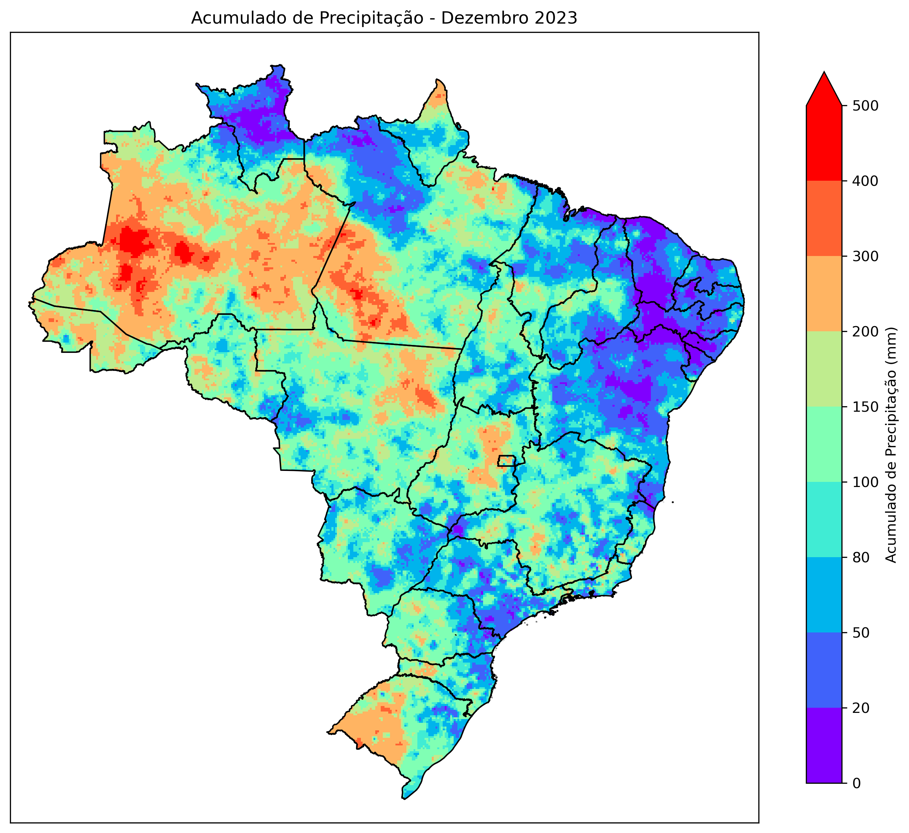
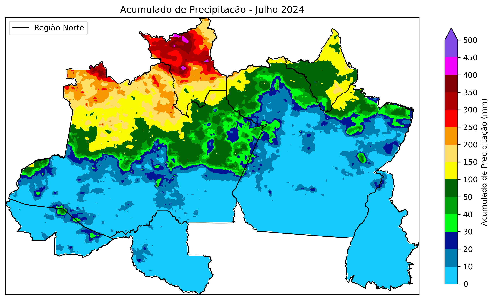

# MERGE_CPTEC

Este repositório contém scripts e dados relacionados ao projeto MERGE_CPTEC, que integra dados de precipitação de diferentes fontes para criar um produto de alta resolução espacial e temporal.

## Descrição

O projeto MERGE_CPTEC visa no aprofundamento de visualização de dados de precipitação utilizando dados de várias fontes, como radares, satélites e pluviômetros. 

## Estrutura do Repositório

- `Scripts/`: Contém scripts utilizados para processar e analisar os dados.
- `Figuras/`: Contém figuras geradas a partir dos dados.

## Imagens

### Figura 1: Exemplo de Precipitação Acumulada Mensal



### Figura 2: Exemplo de Precipitação Acumulada Mensal - Região Norte



## Como Utilizar

1. Clone este repositório:
    ```bash
    git clone https://github.com/valkiriaandrade/MERGE_CPTEC.git
    ```

2. Navegue até o diretório do projeto:
    ```bash
    cd MERGE_CPTEC
    ```

3. Execute os scripts conforme necessário.

## Contribuições

Contribuições são bem-vindas! Sinta-se à vontade para abrir issues e pull requests.

## Licença

Este projeto está licenciado sob a Licença MIT. Veja o arquivo [LICENSE](LICENSE) para mais detalhes.

