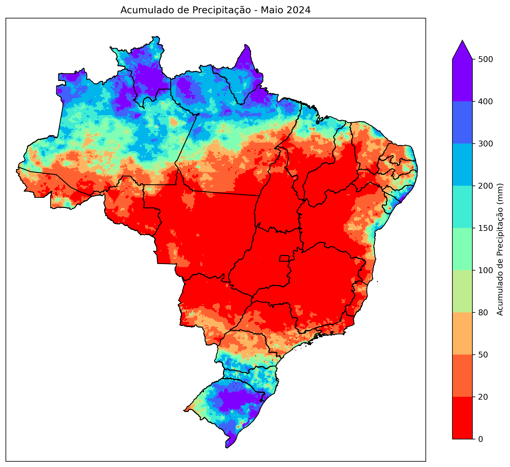
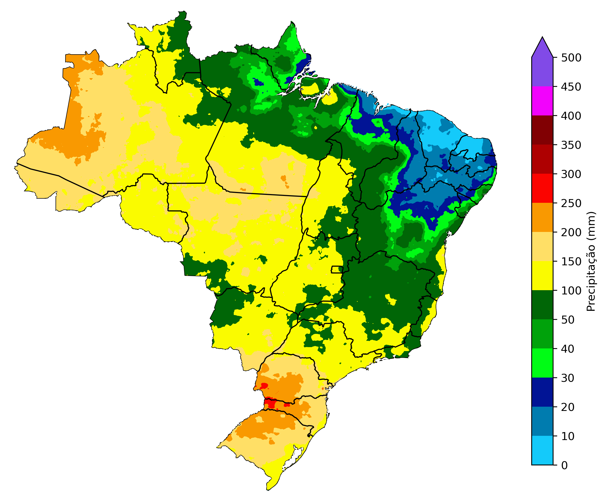
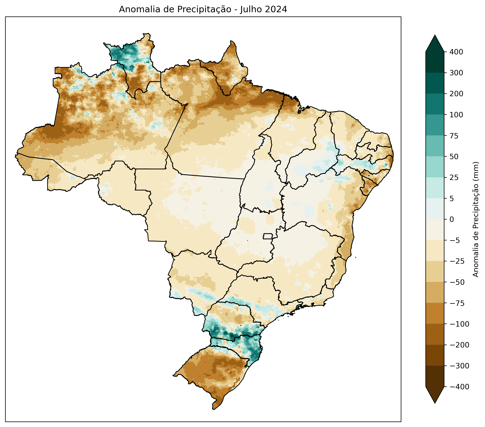
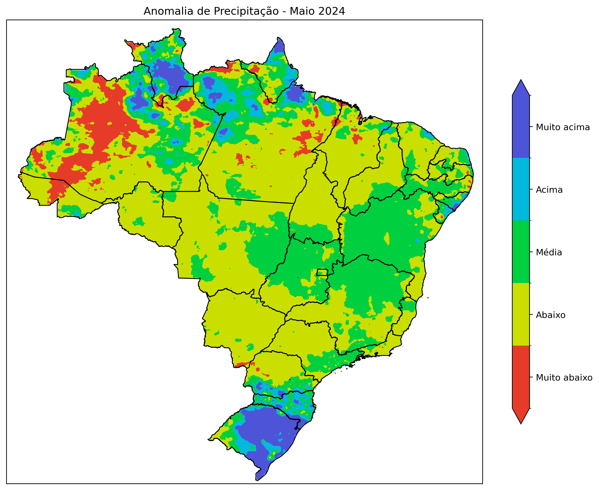

# MERGE-CPTEC

Este repositório contém scripts para a visualização dos dados de precipitação do produto MERGE do INPE/CPTEC. O produto MERGE combina observações de precipitação de várias fontes, como satélites e pluviômetros, para criar um conjunto de dados de alta resolução espacial e temporal.

## Descrição

O projeto MERGE-CPTEC visa no aprofundamento de visualização de dados de precipitação utilizando o produto MERGE do CPTEC/INPE. 

## Estrutura do Repositório

- `Scripts/`: Contém scripts utilizados para processar e analisar os dados.
- `Dados/`: Contém os dados brutos e processados.
- `Figuras/`: Contém figuras geradas a partir dos dados.

## Pré-requisitos

Antes de executar os scripts, você precisará instalar as seguintes bibliotecas Python:

- numpy
- pandas
- matplotlib
- seaborn
- cartopy
- xarray
- netCDF4
  
## Imagens

### Figura 1: Exemplo de Precipitação Acumulada Mensal



### Figura 2: Exemplo de Precipitação Acumulada Mensal - Região Norte


### Figura 3: Exemplo de Climatologia - Outubro



### Figura 3: Exemplo de Anomalia de Precipitação Mensal em mm



### Figura 3: Exemplo de Anomalia de Precipitação Mensal em Desvio Padrão



## Como Utilizar

1. Clone este repositório:
    ```bash
    git clone https://github.com/valkiriaandrade/MERGE-CPTEC.git
    ```

2. Navegue até o diretório do projeto:
    ```bash
    cd MERGE-CPTEC
    ```

3. Execute os scripts conforme necessário.

## Contribuições

Contribuições são bem-vindas! Sinta-se à vontade para abrir issues e pull requests.

## Licença

Este projeto está licenciado sob a Licença MIT. Veja o arquivo [LICENSE](LICENSE) para mais detalhes.

